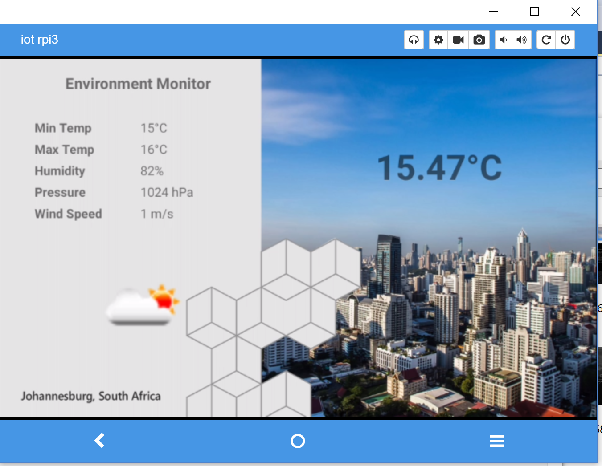
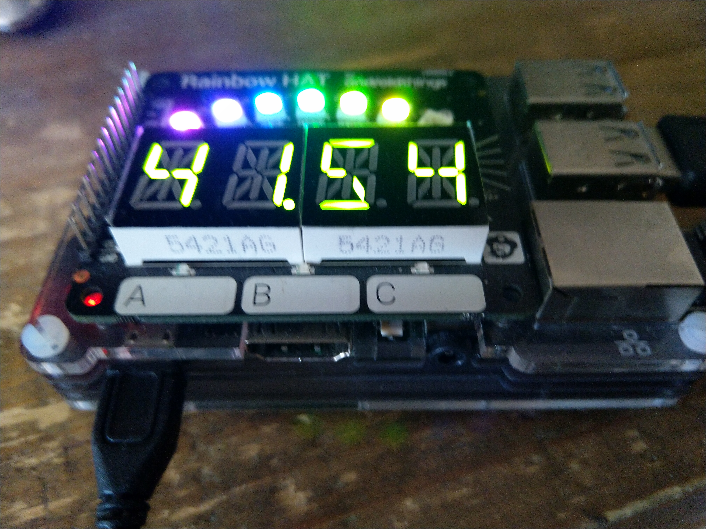
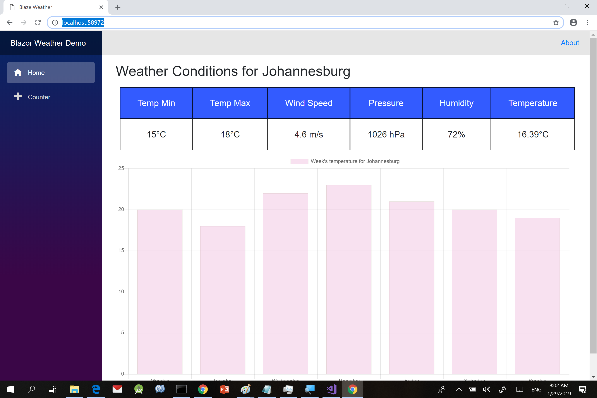
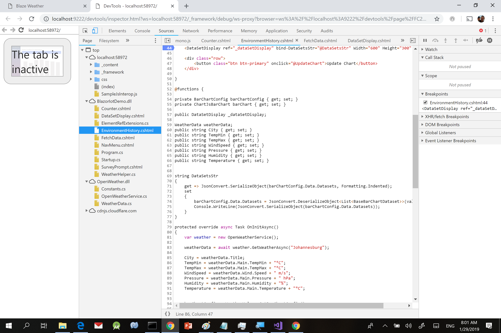
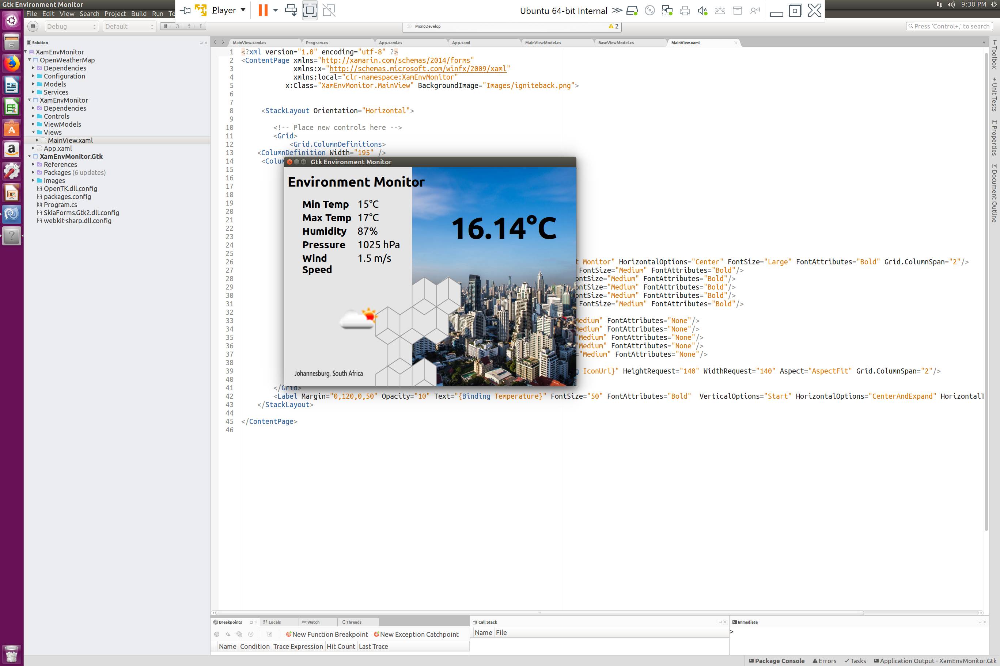

# Xamarin Blazor Environment Monitor

This sample is the code demo from my talk "Xamarin and Beyond" which I did at Microsoft Ignite the Tour Johannesburg. The sample is using Xamarin and .NET Standard to share code between Android, iOS, Android Things, Gtk and Blazor (Web Assembly)

# Android Things

## Android Things Contrib RainbowHAT

# Blazor

## Blazor Debug

# GTK

